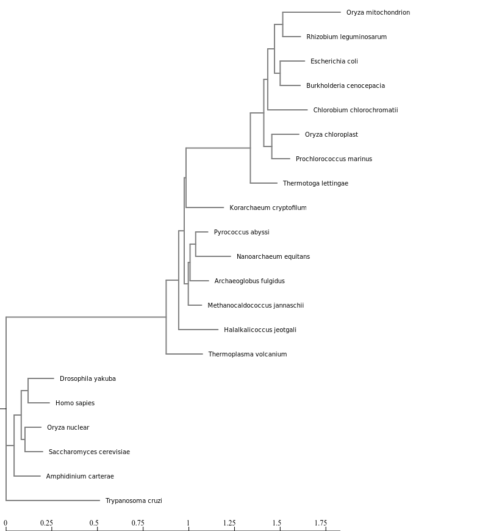

```{r style, echo=FALSE, message=FALSE, warning=FALSE, results="asis"}
library("BiocStyle")
library("knitr")
library("rmarkdown")
library(tidyverse)
library(ggtree)
opts_chunk$set(message = FALSE, error = FALSE, warning = FALSE,
               cache = FALSE, fig.width = 5, fig.height = 5)

```

## Exercises

1. Use NGPhylogeny.fr to analysis the set of rRNA sequence provided. Describe the methods and put the .png file from your analysis into your Lab 8 .Rmd file

Provided FASTA file is a core group of DNA sequences of small subunit ribosomal genes from GenBank. 
Phylogeny analysis was done using the NGPhylogeny.fr web service. The one click analysis used. Below are the steps for the analysis.

1. Input: FASTA
2. Alignment: MAFFT
3. Curation: BMGE
4. Tree interference: FASTME
5. Tree rendering: Newick Display

As output, the newick file and the  images saved. 

2. Align and do phylogenetic analysis off the sequences in CIPRES using MAFFT and FastTreeMP. Here is my step by step tutorial on using CIPRES. You will need to click on Parameter Set and Save even if you don’t change the parameters. Download the fastree_result.tre to your computer.

3. Go through the tutorial on Visualizing and Annotating Phylogenetic Trees with R+ggtree adding the steps to your .Rmd file.

```{r}
tree <- read.tree("data/tree_newick.nwk")
tree
```
```{r}
# build a ggplot with a geom_tree
ggplot(tree) + geom_tree() + theme_tree()
# This is convenient shorthand
ggtree(tree)
```

```{r}
# add a scale
ggtree(tree) + geom_treescale()
# or add the entire scale to the x axis with theme_tree2()
ggtree(tree) + theme_tree2()
```

```{r}
ggtree(tree, branch.length="none")
```
```{r}
ggtree(tree, branch.length="none", color="blue", size=2, linetype=3)
```

## Exercise 1

1. Create a slanted phylogenetic tree.
```{r}
ggtree(tree, layout = "slanted")
```

2. Create a circular phylogenetic tree.
```{r}
ggtree(tree, layout = "circular")
```

3. Create a circular unscaled cladogram with thick red lines.
```{r}
ggtree(tree, layout = "circular",  color="red", size=2)
```

## Exercise 2

```{r}
ggtree(tree) + 
  geom_tippoint(color = "purple", pch = 18) +
  geom_nodepoint(color = "yellow", alpha = 0.5, size = 4) +
  geom_tiplab(color = "purple") + 
  ggtitle("Tree")
```

## Tree Annotations

```{r}
ggtree(tree) + geom_text(aes(label=node), hjust=-.3)
```

```{r}
ggtree(tree) + geom_tiplab()
```

```{r}
MRCA(tree, c("C", "E"))
```

```{r}
MRCA(tree, c("G", "H"))
```

## Labeling clades

```{r}
ggtree(tree) + 
  geom_cladelabel(node=17, label="Some random clade", color="red")
```

```{r}
ggtree(tree) + 
  geom_tiplab() + 
  geom_cladelabel(node=17, label="Some random clade", 
                  color="red2", offset=.8)
```

```{r}
ggtree(tree) + 
  geom_tiplab() + 
  geom_cladelabel(node=17, label="Some random clade", 
                  color="red2", offset=.8) + 
  geom_cladelabel(node=21, label="A different clade", 
                  color="blue", offset=.8)
```

```{r}
ggtree(tree) + 
  geom_tiplab() + 
  geom_cladelabel(node=17, label="Some random clade", 
                  color="red2", offset=.8, align=TRUE) + 
  geom_cladelabel(node=21, label="A different clade", 
                  color="blue", offset=.8, align=TRUE) + 
  theme_tree2() + 
  xlim(0, 70) + 
  theme_tree()
```
```{r}
ggtree(tree) + 
  geom_tiplab() + 
  geom_hilight(node=17, fill="gold") + 
  geom_hilight(node=21, fill="purple")
```

## Connecting taxa

```{r}
ggtree(tree) + 
  geom_tiplab() + 
  geom_taxalink("E", "H", color="blue3") +
  geom_taxalink("C", "G", color="orange2", curvature=-.9)
```

## Exercise 3

```{r}
BC <- MRCA(tree, c("B", "C"))
LJ <- MRCA(tree, c("L", "J"))

ggtree(tree) +
  geom_tiplab() +
  geom_hilight(node=BC, fill="gold") + 
  geom_hilight(node=LJ, fill="purple") +
  geom_cladelabel(node=17, label="Some random clade", 
                  color="red2", offset=.8, align=TRUE) +
  geom_taxalink("C", "E", color="gray", linetype=2) +
  geom_taxalink("G", "J", color="gray", linetype=2) +
  theme_tree2() + 
  xlim(0, 70) + 
  ggtitle("Exercise 3") + 
  theme_tree2()
```


## Advanced tree annotation
```{r}
# Read the data
tree <- treeio::read.beast("data/flu_tree_beast.tree")
# supply a most recent sampling date so you get the dates
# and add a scale bar
ggtree(tree, mrsd="2013-01-01") + 
  theme_tree2() 
# Finally, add tip labels and adjust axis
ggtree(tree, mrsd="2013-01-01") + 
  theme_tree2() + 
  geom_tiplab(align=TRUE, linesize=.5) + 
  xlim(1990, 2020)
```

```{r}
msaplot(p=ggtree(tree), fasta="data/flu_aasequence.fasta", window=c(150, 175))
```


```{r}
set.seed(42)
trees <- lapply(rep(c(10, 25, 50, 100), 3), rtree)
class(trees) <- "multiPhylo"
ggtree(trees) + facet_wrap(~.id, scale="free", ncol=4) + ggtitle("Many trees. Such phylogenetics. Wow.")
```

```{r}
# Generate a random tree with 30 tips
tree <- rtree(30)
# Make the original plot
p <- ggtree(tree)
# generate some random values for each tip label in the data
d1 <- data.frame(id=tree$tip.label, val=rnorm(30, sd=3))
# Make a second plot with the original, naming the new plot "dot", 
# using the data you just created, with a point geom.
p2 <- facet_plot(p, panel="dot", data=d1, geom=geom_point, aes(x=val), color='red3')
# Make some more data with another random value.
d2 <- data.frame(id=tree$tip.label, value = abs(rnorm(30, mean=100, sd=50)))
# Now add to that second plot, this time using the new d2 data above, 
# This time showing a bar segment, size 3, colored blue.
p3 <- facet_plot(p2, panel='bar', data=d2, geom=geom_segment, 
           aes(x=0, xend=value, y=y, yend=y), size=3, color='blue4') 
# Show all three plots with a scale
p3 + theme_tree2()
```

```{r}
# get phylopic 

newick <- "((Pongo_abelii,(Gorilla_gorilla_gorilla,(Pan_paniscus,Pan_troglodytes)Pan,Homo_sapiens)Homininae)Hominidae,Nomascus_leucogenys)Hominoidea;"

tree <- read.tree(text=newick)

d <- ggimage::phylopic_uid(tree$tip.label)
d$body_mass = c(52, 114, 47, 45, 58, 6)

p <- ggtree(tree) %<+% d + 
  geom_tiplab(aes(image=uid, colour=body_mass), geom="phylopic", offset=2.5) +
  geom_tiplab(aes(label=label), offset = .2) + xlim(NA, 7) +
  scale_color_viridis_c()
p  
```


